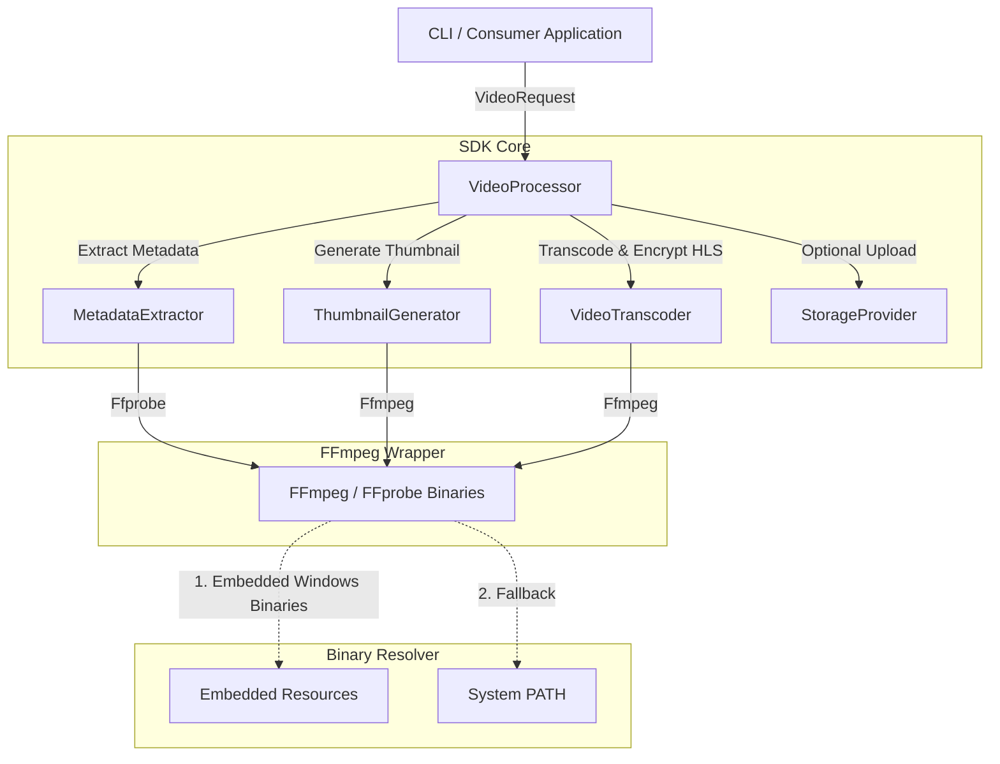

# TranscodeX SDK

TranscodeX is a high-performance, developer-focused **Java 25** SDK designed for seamless, multi-threaded FFmpeg media processing workflows. It is packaged as a reusable library with automatic Spring Boot configuration, and also includes a built-in command-line interface (CLI) in its standalone executable JAR.

## Architecture

The following diagram illustrates how your application or the CLI interacts with the TranscodeX SDK components:



---

## Features

- **HLS Adaptive Streaming**: Generates master adaptive playlists (`.m3u8`) and individual resolution sub-playlists automatically.
- **AES-128 Chunk Encryption**: Full DRM support for encrypting media segments with dynamic rotation keys.
- **Zero-Config Windows Bundling**: Embedded Windows `ffmpeg` and `ffprobe` binaries are auto-extracted on startup for a seamless plug-and-play developer experience.
- **Multi-Platform Fallback**: Auto-detects Linux/macOS and uses system-installed binaries from the `PATH` (ideal for containerized cloud deployment/Kubernetes).
- **Flexible Spring Auto-Configuration**: Automatically registers components as Spring beans when included in Spring Boot projects.
- **Properties-Based Defaults**: Easy global adjustments through configuration property overrides.
- **Standalone Command-Line Tool**: Simple CLI execution wrapper built directly into the fat JAR.

---

## Prerequisites

Before using the TranscodeX SDK or running the standalone JAR, ensure your environment meets the following requirements:

### 1. Java Runtime Environment (JRE) / JDK 25
The SDK is compiled to target **Java 25** to leverage modern language features (such as Pattern Matching, Record Classes, and Virtual Threads).
* To install Java 25 using **SDKMAN** (recommended):
  ```bash
  sdk install java 25-open
  ```
* To install on **Ubuntu/Debian**:
  ```bash
  sudo apt-get update
  sudo apt-get install -y openjdk-25-jdk
  ```
* To install on **macOS** (using Homebrew):
  ```bash
  brew install openjdk@25
  ```

### 2. FFmpeg & FFprobe (Non-Windows Only)
* **Windows**: **No actions required.** The SDK packages embedded binaries and resolves them automatically on startup.
* **Linux (Ubuntu/Debian)**:
  ```bash
  sudo apt-get update && sudo apt-get install -y ffmpeg
  ```
* **Linux (CentOS/RHEL)**:
  ```bash
  sudo dnf install -y ffmpeg
  ```
* **macOS**:
  ```bash
  brew install ffmpeg
  ```

---

## Building the Artifacts

Compile, test, and build the project from source using Maven:

```bash
mvn clean package
```

This compiles the codebase, runs the test suite, and produces **two** JAR artifacts in the `target/` directory:
1. `transcodex-sdk-0.1.0-SNAPSHOT.jar`
   * **Thin library JAR** for inclusion in other projects. Does not package dependencies (Jackson, SLF4J, etc.).
2. `transcodex-sdk-0.1.0-SNAPSHOT-all.jar`
   * **Standalone executable fat JAR**. Shaded with all dependencies, containing the interactive command-line interface (CLI).

---

## Standalone CLI Usage Guide

Run the shaded executable JAR from your command line:

```bash
java -jar target/transcodex-sdk-0.1.0-SNAPSHOT-all.jar -i <input_file> -o <output_directory> [options]
```

### CLI Command Options

| Argument | Long Flag | Description |
|---|---|---|
| `-i <path>` | `--input <path>` | **[Required]** Path to the input video file. |
| `-o <dir>` | `--output <dir>` | **[Required]** Path to output directory to save output playlists, segments, and thumbnail. |
| `-r <list>` | `--resolutions <list>`| Comma-separated resolutions to transcode (`360p`, `480p`, `720p`, `1080p`, `2160p`/`4k`, `4320p`/`8k`). Default: `360p,720p`. |
| `-e` | `--encrypt` | Enable AES-128 chunk encryption for HLS segments. Auto-forces HLS generation. |
| `-t <num>` | `--threads <num>` | Number of CPU threads dedicated to transcoding operations (default: `4`). |
| | `--no-hls` | Disable HLS adaptive stream playlist generation. |
| | `--no-thumbnail` | Disable thumbnail generation (extracted by default). |
| | `--thumbnail-width <w>`| Custom width for generated thumbnail (default: `320`). |
| | `--thumbnail-height <h>`| Custom height for generated thumbnail (default: `180`). |
| | `--thumbnail-pos <sec>`| Keyframe offset timestamp (in seconds) to extract thumbnail (default: `0.5`). |
| | `--thumbnail-format <f>`| Format for generated thumbnail: `jpg` or `png` (default: `jpg`). |
| `-h` | `--help` | Show the help screen and CLI syntax instructions. |

---

## CLI Use Case Examples

Here are common copy-pasteable use cases for running the CLI.

### Use Case 1: Simple Transcoding with Default Settings
Transcodes input video into default resolutions (`360p` & `720p`) and extracts a JPG thumbnail at 0.5s into the output directory:
```bash
java -jar target/transcodex-sdk-0.1.0-SNAPSHOT-all.jar -i sample.mp4 -o ./output/usecase1
```

### Use Case 2: Custom Resolutions Transcoding
Transcodes the video into only `480p` and high-definition `1080p`:
```bash
java -jar target/transcodex-sdk-0.1.0-SNAPSHOT-all.jar -i sample.mp4 -o ./output/usecase2 -r 480p,1080p
```

### Use Case 3: Encrypted HLS adaptive streaming (DRM)
Transcodes to default resolutions, generates HLS segments, and encrypts them using AES-128 keys with an auto-generated master playlist:
```bash
java -jar target/transcodex-sdk-0.1.0-SNAPSHOT-all.jar -i sample.mp4 -o ./output/usecase3 -e
```

### Use Case 4: High-Performance Processing with Custom Thumbnail
Allocates 8 threads for transcribing, disables HLS (generates raw formats/metadata), and extracts a high-res PNG thumbnail at the 5-second mark:
```bash
java -jar target/transcodex-sdk-0.1.0-SNAPSHOT-all.jar -i sample.mp4 -o ./output/usecase4 --no-hls --thumbnail-width 1280 --thumbnail-height 720 --thumbnail-pos 5.0 --thumbnail-format png -t 8 -r 720p
```

---

## SDK Integration Guide

To use TranscodeX programmatic services in your own Java application, import the SDK JAR.

### Option A: Local Maven Install (Recommended for Local Dev)
Install the JAR files to your local Maven repository (`~/.m2/repository`):
```bash
mvn clean install
```
Then, add the dependency in your application's `pom.xml`:
```xml
<dependency>
    <groupId>io.transcodex</groupId>
    <artifactId>transcodex-sdk</artifactId>
    <version>0.1.0-SNAPSHOT</version>
</dependency>
```

### Option B: Local Lib Dependency
Place the compiled `transcodex-sdk-0.1.0-SNAPSHOT.jar` inside your project's local `libs/` folder and include it via system path in `pom.xml`:
```xml
<dependency>
    <groupId>io.transcodex</groupId>
    <artifactId>transcodex-sdk</artifactId>
    <version>0.1.0-SNAPSHOT</version>
    <scope>system</scope>
    <systemPath>${project.basedir}/libs/transcodex-sdk-0.1.0-SNAPSHOT.jar</systemPath>
</dependency>
```

---

## Integrating Programmatically in Your Code

### 1. Spring Boot Setup (Plug & Play)
Because the SDK provides Spring Boot auto-configuration classes, it registers components automatically on startup. Autowire the `VideoProcessor` bean:

```java
import io.transcodex.api.video.VideoProcessor;
import io.transcodex.core.config.TranscodexProperties;
import io.transcodex.core.video.VideoRequest;
import io.transcodex.core.video.VideoResult;
import org.springframework.beans.factory.annotation.Autowired;
import org.springframework.stereotype.Service;
import java.nio.file.Path;

@Service
public class MediaService {

    @Autowired
    private VideoProcessor videoProcessor;

    @Autowired
    private TranscodexProperties sdkProperties;

    public void processVideo(Path sourceFile, Path outputDirectory) {
        VideoRequest request = VideoRequest.builder(sdkProperties)
                .source(sourceFile)
                .outputDir(outputDirectory)
                .build();

        VideoResult result = videoProcessor.process(request);
        
        System.out.println("Transcoding finished!");
        result.masterPlaylist().ifPresent(p -> System.out.println("Master Playlist: " + p));
        result.thumbnail().ifPresent(t -> System.out.println("Thumbnail extracted to: " + t.path()));
    }
}
```

### 2. Plain Java Setup (No Spring Boot)
For non-Spring applications, initialize the default processor directly using the static factory:

```java
import io.transcodex.api.video.VideoProcessor;
import io.transcodex.api.video.VideoProcessorFactory;
import io.transcodex.core.config.TranscodexProperties;
import io.transcodex.core.video.VideoRequest;
import io.transcodex.core.video.VideoResult;
import java.nio.file.Path;

public class Main {
    public static void main(String[] args) {
        // Automatically loads classpath configurations if 'transcodex.properties' is present
        TranscodexProperties properties = new TranscodexProperties();
        VideoProcessor processor = VideoProcessorFactory.createDefault();

        VideoRequest request = VideoRequest.builder(properties)
                .source(Path.of("input_movie.mp4"))
                .outputDir(Path.of("./output_folder"))
                .build();

        VideoResult result = processor.process(request);
        System.out.println("Pipeline completed successfully.");
    }
}
```

---

## Configuration Properties

You can customize defaults globally using `application.properties` (for Spring Boot projects) or a `transcodex.properties` file in the root of your classpath.

| Configuration Property | Default Value | Description |
|---|---|---|
| `transcodex.default.resolutions` | `360p,720p` | Comma-separated list of default resolutions (`360p`, `480p`, `720p`, `1080p`, `4k`, `8k`) |
| `transcodex.default.encrypt-chunks` | `false` | Enable/disable AES-128 segment encryption for HLS |
| `transcodex.default.encoding-threads` | `4` | Number of threads dedicated to video transcoder operations |
| `transcodex.default.generate-hls` | `true` | Enable/disable default HLS segment generation |
| `transcodex.default.generate-thumbnail` | `true` | Enable/disable default thumbnail generation |
| `transcodex.default.thumbnail.width` | `320` | Default width for generated thumbnails |
| `transcodex.default.thumbnail.height` | `180` | Default height for generated thumbnails |
| `transcodex.default.thumbnail.format` | `jpg` | Format for generated thumbnails (`jpg`, `png`) |
| `transcodex.default.thumbnail.position-seconds` | `0.5` | Extracted keyframe offset position (in seconds) |
| `transcodex.default.max-concurrent-transcodes`| `Available CPU Cores / 4` | Maximum concurrent transcoder operations running globally |
| `transcodex.default.process-timeout-seconds` | `1800` | Process execution timeout threshold in seconds |

---

## License

This project is licensed under the Apache License 2.0.
