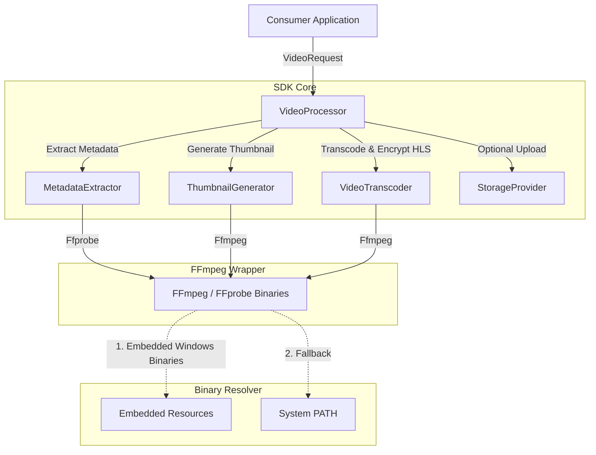

# TranscodeX SDK

TranscodeX is a high-performance, developer-focused Java 25 SDK designed for seamless, multi-threaded FFmpeg media processing workflows. It is packaged as a ready-to-use Spring Boot library and supports plug-and-play local execution by bundling Windows 64-bit binaries.

## Architecture

The following diagram illustrates how the consumer application interacts with the TranscodeX SDK components:



---

## Features

- **HLS Adaptive Streaming**: Generates master adaptive playlists (`.m3u8`) and individual resolution sub-playlists automatically.
- **AES-128 Chunk Encryption**: Full DRM support for encrypting media segments with dynamic rotation keys.
- **Zero-Config Windows Bundling**: Embedded Windows `ffmpeg` and `ffprobe` binaries are auto-extracted on startup for a seamless plug-and-play developer experience.
- **Multi-Platform Fallback**: Auto-detects Linux/macOS and uses system-installed binaries from the `PATH` (ideal for containerized cloud deployment/Kubernetes).
- **Flexible Spring Auto-Configuration**: Automatically registers components as Spring beans when included in Spring Boot projects.
- **Properties-Based Defaults**: Easy global adjustments through configuration property overrides.

---

## Prerequisites (Non-Windows Only)

On Windows systems, FFmpeg is fully self-contained. For non-Windows environments (such as Linux production servers), ensure `ffmpeg` and `ffprobe` are installed on the host environment:

```bash
# Ubuntu/Debian
sudo apt-get update && sudo apt-get install -y ffmpeg

# CentOS/RHEL
sudo dnf install -y ffmpeg

# macOS
brew install ffmpeg
```

---

## Integration Guide

### 1. Include the SDK JAR

If you are using the SDK in a Spring Boot application, copy the generated `transcodex-sdk-0.1.0-SNAPSHOT.jar` file to your project's local `libs` directory and add the following dependency configuration in your `pom.xml`:

```xml
<dependency>
    <groupId>io.transcodex</groupId>
    <artifactId>transcodex-sdk</artifactId>
    <version>0.1.0-SNAPSHOT</version>
    <scope>system</scope>
    <systemPath>${project.basedir}/libs/transcodex-sdk-0.1.0-SNAPSHOT.jar</systemPath>
</dependency>
```

### 2. Spring Boot Setup (Plug & Play)

Since the SDK includes Spring Boot auto-configuration metadata, it is automatically registered when the application starts up. Simply inject or autowire the `VideoProcessor` bean:

```java
import io.transcodex.api.video.VideoProcessor;
import io.transcodex.core.video.*;
import org.springframework.beans.factory.annotation.Autowired;
import org.springframework.stereotype.Service;
import java.nio.file.Path;

@Service
public class MediaService {

    @Autowired
    private VideoProcessor videoProcessor;

    @Autowired
    private io.transcodex.core.config.TranscodexProperties sdkProperties;

    public void processVideo(Path sourceFile, Path outputDirectory) {
        // Build video request using defaults loaded from properties
        VideoRequest request = VideoRequest.builder(sdkProperties)
                .source(sourceFile)
                .outputDir(outputDirectory)
                .build();

        VideoResult result = videoProcessor.process(request);
        System.out.println("Processing finished! Master Playlist: " + result.masterPlaylist());
    }
}
```

### 3. Plain Java Setup (No-Spring)

For lightweight, standard Java environments, use the factory utility class to instantiate the default processor:

```java
import io.transcodex.api.video.VideoProcessor;
import io.transcodex.api.video.VideoProcessorFactory;
import io.transcodex.core.config.TranscodexProperties;
import io.transcodex.core.video.*;
import java.nio.file.Path;

public class Main {
    public static void main(String[] args) {
        // Resolve default settings from classpath 'transcodex.properties'
        TranscodexProperties properties = new TranscodexProperties();
        VideoProcessor processor = VideoProcessorFactory.createDefault();

        VideoRequest request = VideoRequest.builder(properties)
                .source(Path.of("my_video.mp4"))
                .outputDir(Path.of("./output"))
                .build();

        VideoResult result = processor.process(request);
    }
}
```

---

## Configuration Properties

You can customize the SDK's defaults using `application.properties` (for Spring Boot projects) or `transcodex.properties` on the root of your classpath (for plain Java projects).

| Configuration Property | Default Value | Description |
|---|---|---|
| `transcodex.default.resolutions` | `360p,720p` | Comma-separated list of default resolutions (`360p`, `480p`, `720p`, `1080p`, `4K`, `8K`) |
| `transcodex.default.encrypt-chunks` | `false` | Enable/disable AES-128 segment encryption for HLS |
| `transcodex.default.encoding-threads` | `4` | Number of threads dedicated to video transcoder operations |
| `transcodex.default.generate-hls` | `true` | Enable/disable default HLS segment generation |
| `transcodex.default.generate-thumbnail` | `true` | Enable/disable default thumbnail generation |
| `transcodex.default.thumbnail.width` | `320` | Default width for generated thumbnails |
| `transcodex.default.thumbnail.height` | `180` | Default height for generated thumbnails |
| `transcodex.default.thumbnail.format` | `jpg` | Format for generated thumbnails (`jpg`, `png`) |
| `transcodex.default.thumbnail.position-seconds` | `0.5` | Extracted keyframe offset position (in seconds) |

---

## License

This project is licensed under the Apache License 2.0.
