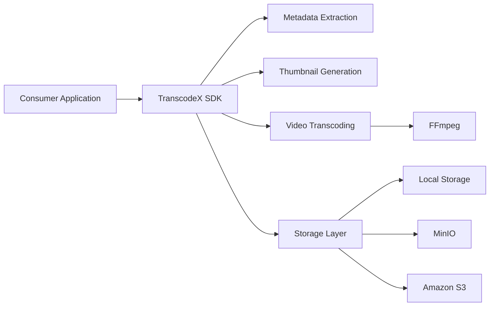
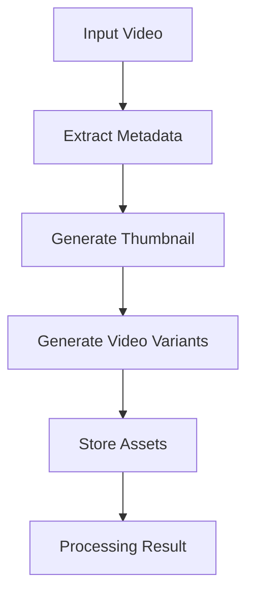
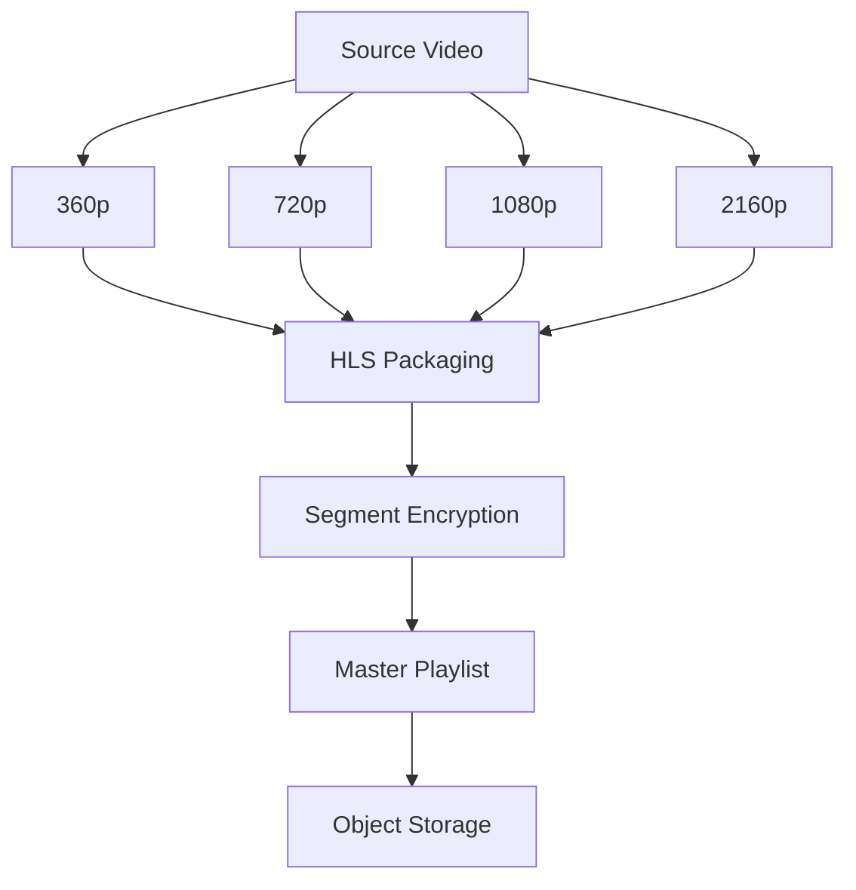
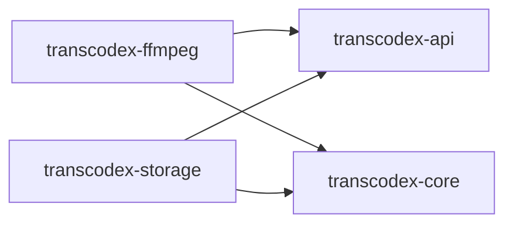
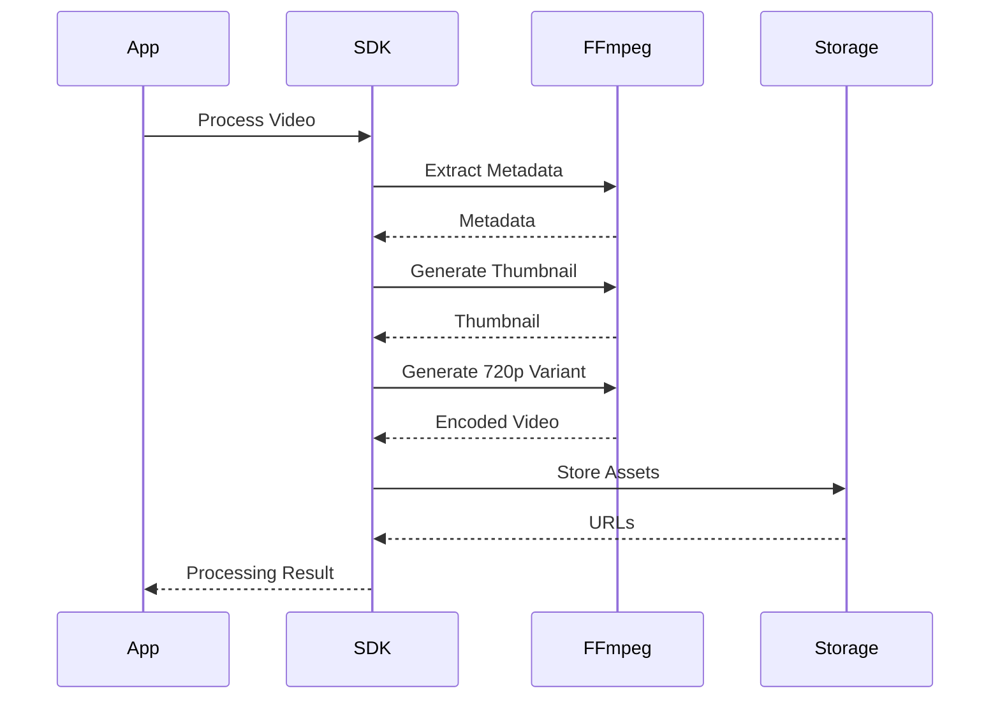

# 🚀 TranscodeX-SDK

> High-performance, modular Java SDK for video transcoding, thumbnail generation, adaptive streaming, encryption, and media processing workflows powered by FFmpeg.

---

## 🎯 Vision

TranscodeX-SDK is designed to be a production-grade media processing framework that can be embedded into any Java application.

Whether you're building:

- 🎬 OTT Platforms
- 📚 Learning Management Systems
- 🎥 Video Sharing Applications
- 🏢 Enterprise Media Platforms
- 🎮 Streaming Applications

TranscodeX-SDK provides a clean, extensible, and high-performance API for video processing.

---

## ✨ Features

### Current

- Video Metadata Extraction
- Thumbnail Generation
- Video Transcoding
- Multi-Resolution Encoding
- Local Storage Support

### Planned

- HLS Packaging
- DASH Streaming
- AES-128 Segment Encryption
- Signed Playback URLs
- MinIO Integration
- Amazon S3 Integration
- NVENC GPU Acceleration
- AV1 Encoding
- Event-Driven Processing
- Spring Boot Starter
- Metrics & Observability

---

# 🏗 Architecture

## High-Level Architecture



---

## Processing Pipeline



---

## Future Adaptive Streaming Pipeline



---

# 📦 Module Structure

```text
transcodex-sdk
│
├── docs
├── examples
├── benchmarks
│
├── transcodex-api
├── transcodex-core
├── transcodex-ffmpeg
├── transcodex-storage
│
├── pom.xml
└── README.md
```

---

## Module Responsibilities

| Module | Responsibility |
|----------|----------|
| transcodex-api | Public contracts and SDK interfaces |
| transcodex-core | Domain models and exceptions |
| transcodex-ffmpeg | FFmpeg integration and execution |
| transcodex-storage | Storage abstraction layer |

---

# 🔄 Module Dependency Graph



---

# 🧠 Design Principles

### Framework First

TranscodeX is built as a reusable SDK, not a standalone application.

### Performance Focused

- Streaming I/O
- Virtual Threads
- Parallel Processing
- GPU Acceleration Ready
- Zero-Copy File Operations

### Extensible

Every major component is built around contracts.

```java
public interface VideoProcessor {
    VideoResult process(VideoRequest request);
}
```

---

# 🎬 Planned Video Processing Workflow



---

# ⚡ Performance Goals

| Capability | Target |
|------------|----------|
| Metadata Extraction | < 500ms |
| Thumbnail Generation | < 2s |
| 1080p Transcoding | GPU Accelerated |
| Memory Usage | Stream-Based |
| Concurrent Jobs | Virtual Thread Ready |

---

# 🛣 Roadmap

## v0.1

- Metadata Extraction
- Thumbnail Generation
- 720p Transcoding
- Local Storage

## v0.2

- Multi-Resolution Encoding
- Parallel Processing
- MinIO Integration

## v0.3

- HLS Packaging
- Adaptive Streaming

## v0.4

- AES-128 Segment Encryption
- Signed URLs

## v1.0

- Spring Boot Starter
- Metrics
- Event System
- Production Release

---

# 💻 Example Usage

```java
VideoRequest request =
        VideoRequest.builder()
                .source(videoPath)
                .resolution(Resolution.P720)
                .generateThumbnail(true)
                .build();

VideoResult result =
        videoProcessor.process(request);
```

---

# 🔧 Technology Stack

- Java 25
- Maven
- FFmpeg
- FFprobe
- JUnit 5
- Testcontainers
- Spotless
- Checkstyle
- JaCoCo

---

# 📜 License

MIT License

---

Built with ☕ Java and ❤️ for media engineers.