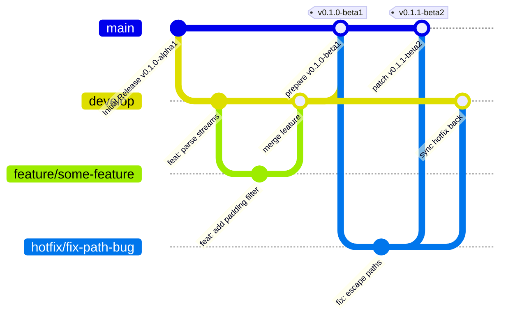
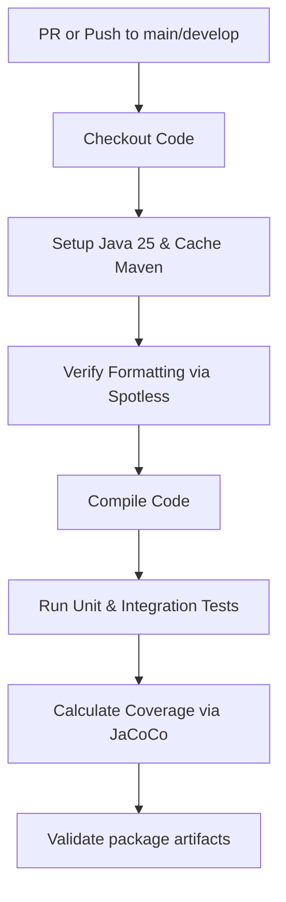
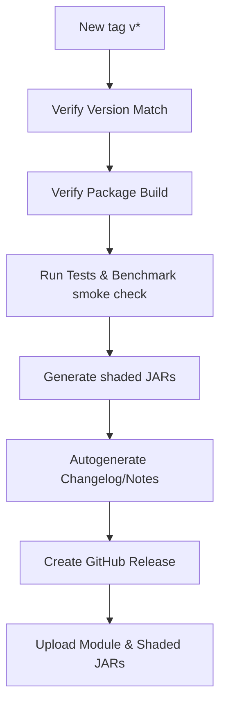

# CI/CD & Release Engineering System

This document outlines the Git branching strategy, pipeline workflows, release engineering lifecycle, and dependency maintenance guidelines for the TranscodeX SDK.

---

## 1. Branching Strategy

We use a structured branch topology to isolate features, manage releases, and apply critical hotfixes to the codebase:



### Git Branch Types
- **`main`**: Production code. Only accepts merges from `release/*` or `hotfix/*`.
- **`develop`**: Primary integration branch. All features target this branch.
- **`feature/*`**: Transient branches for single features. Must pass CI check before merging to `develop`.
- **`release/*`**: Created to isolate release work. Increments version and writes release notes.
- **`hotfix/*`**: Used for critical patches on main. Merges back to both `main` and `develop`.

---

## 2. CI/CD Workflow Pipelines

### Workflow 1: Continuous Integration (`ci.yml`)
Triggered on push/pull request against `main` and `develop`.



### Workflow 2: Release Pipeline (`release.yml`)
Triggered when a version tag (`v*`) is pushed.



---

## 3. Release Engineering & Version Promotion

We adhere to Semantic Versioning (`MAJOR.MINOR.PATCH[-PRERELEASE]`).

### Version Formats
- **Alpha (`vX.Y.Z-alphaN`)**: Pre-releases for early feature testing. Built from `develop`.
- **Beta (`vX.Y.Z-betaN`)**: Code-complete, bug-fixing phase. Built from release branches.
- **Stable (`vX.Y.Z`)**: Production releases. Built from `main`.

### Promotion Path
```text
[develop branch] ──> v0.1.0-alpha1 (Alpha Testing)
       │
[feature freeze]
       │
       ▼
[release branch] ──> v0.1.0-beta1 (Beta verification / QA)
       │
[security audits & benchmark validations]
       │
       ▼
[main branch]    ──> v0.1.0 (Stable Release)
```

---

## 4. Repository Configuration

The following secret must be present in the GitHub repository:
- `GITHUB_TOKEN`: Inherited permission token allowing workflows to write releases and publish test reports.
