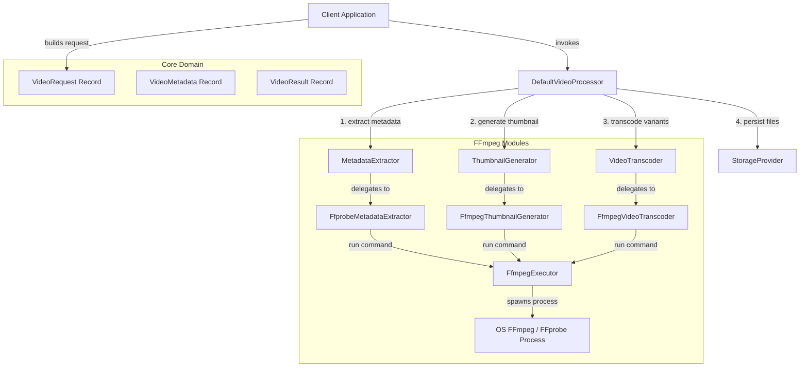

# High-Level Architecture Diagram

This document describes the structural boundaries, components, and pipeline data flow of the TranscodeX SDK.

---

## 1. High-Level Structural Diagram

---

## 2. Components Explanation

- **Client Application**: The consuming service that imports the SDK, configures executors, and requests media processing.
- **Core Domain Records**: Immutable Java 25 models (`VideoRequest`, `VideoMetadata`, `VideoResult`) defining clean contracts for inputs and outputs.
- **DefaultVideoProcessor**: The core pipeline manager coordinating operations (metadata extraction, thumbnail generation, transcoding) using an injected `ExecutorService`.
- **FFmpeg Execution Layer**: Wraps native command invocations. Concrete classes like `FfprobeMetadataExtractor` isolate shell process parameters from core business logic.
- **FfmpegExecutor (ProcessBuilderExecutor)**: Spawns the native process, managing stdout/stderr streams to prevent buffer deadlock.

---

## 3. Data Flow

1. The client instantiates a `VideoRequest` with input/output paths, target resolutions, and thumbnail config.
2. The `DefaultVideoProcessor` receives the request and extracts metadata using `MetadataExtractor`.
3. The processor validates the source format and dimensions, and schedules the thumbnail extraction and multi-resolution transcodes.
4. Each scheduled task spawns a native OS process asynchronously via the `FfmpegExecutor`.
5. Outputs are gathered, uploaded to the `StorageProvider` (if configured), and returned as a single `VideoResult` record.

---

## 4. Performance Considerations

- **Non-blocking Subprocesses**: Native OS processes are managed using virtual threads, preventing thread starvation.
- **Stream Draining**: Standard output and error streams are drained asynchronously in background tasks, preventing process hangs.
- **Garbage Collection Efficiency**: Immutable record models reduce object mutation overhead, leading to efficient GC behavior.
